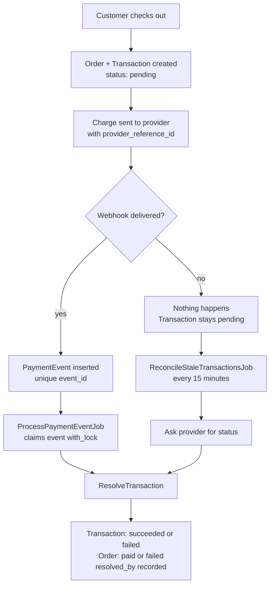

# Merchant Webhook App

A small Rails service that receives payment webhooks, processes them idempotently, and reconciles
against the payment provider to recover payments whose webhook never arrived.

Three failure modes, three guards:

| Failure | Guard |
| --- | --- |
| The same event delivered twice | Unique index on `payment_events.event_id` |
| One payment resolved by two paths | Conditional `UPDATE ... WHERE status = 'pending'` |
| No event delivered at all | `ReconcileStaleTransactionsJob` |

## Flow



Same destination, two routes. `resolved_by` records which one got there.

## Data model

| Model | Purpose |
| --- | --- |
| `Customer`, `Order` | What the customer is buying. `pending` to `paid` or `failed`. |
| `Transaction` | One attempt to collect payment. `pending` to `succeeded` or `failed`. Holds `provider_reference_id`, `resolved_by`, `resolved_at`. |
| `PaymentEvent` | The raw webhook record. Unique on `event_id`, linked to the Transaction it resolved. |
| `ProviderCharge` | Stands in for the provider's own ledger. |

`provider_reference_id` is an id this app generates and hands to the provider, which the provider
echoes back in every webhook so its replies match exactly one row.

An Order has many Transactions, since a declined card can legitimately be retried.
`ProviderCharge` exists locally because reconciliation needs an independent source of truth;
re-reading your own data isn't reconciliation.

## How it works

### Receiving a webhook

1. `WebhooksController#payments` validates `event_id` and `event_type`, then delegates to
   `IngestWebhookEvent`. Only whitelisted payload fields (`PERMITTED_PAYLOAD_FIELDS`) are stored,
   and `provider_reference_id` must be among them or events can never match a payment.
2. Event-level idempotency is enforced by the database: `event_id` is uniquely indexed, so a
   duplicate delivery fails to insert rather than double-processing.
3. Duplicates get `200 OK` with `duplicate_ignored`. A non-2xx would only make the provider retry.
4. `ProcessPaymentEventJob` is enqueued, keeping the response fast.

### Processing the event

5. The job claims the event inside `event.with_lock { ... }`, so two workers can't both pass the
   "already processed?" check. The queue is at-least-once, so the same job can arrive twice.
6. `payment.succeeded` and `payment.failed` map to outcomes. Anything else is marked `ignored`.
7. The Transaction is found by `payload["provider_reference_id"]`. No match means `orphaned`,
   logged at error level rather than swallowed.
8. `ResolveTransaction` decides the payment.

### Reconciliation

9. `ReconcileStaleTransactionsJob` runs every 15 minutes, finds Transactions still `pending` past
   `STALE_AFTER`, asks the provider what happened, and resolves them through the same
   `ResolveTransaction` path a webhook would use.
10. If the provider has no outcome yet, the Transaction stays `pending` and is rechecked next run.
    `pending` means either the webhook was lost or the payment is still clearing, and only the
    provider knows which.

This is the only thing that can detect a webhook that never arrived. Absence of a webhook produces
no event, so nothing runs, nothing errors, nothing alerts, and the payment sits `pending` while the
customer's money is already gone.

## Resolving a payment exactly once

`ResolveTransaction` is the only place a payment is decided, and both paths call it:

```ruby
rows = Transaction.where(id: txn.id, status: "pending")
                  .update_all(status: outcome, resolved_at: ..., resolved_by: ...)
```

`rows == 1` means this caller won and runs the side effects. `0` means something else already
resolved it, so the caller is a no-op. The Transaction and its Order update in one database
transaction, and `FulfillOrderJob` is enqueued only after commit, since a job enqueued inside a
transaction survives a rollback.

The unique index doesn't cover this. It makes event **ingestion** idempotent, not payment
**resolution**. One payment legitimately produces several events;

Reconciliation heals `pending` to a terminal state automatically. But if it finds a payment already
settled, the status is left alone: fulfilment may already have run, and unwinding it is a refund,
not a status overwrite.

```ruby
Transaction.succeeded.group(:resolved_by).count
# => {"webhook" => 74, "reconciliation" => 26}
```

## Requirements

Ruby, Rails, PostgreSQL, Redis, Sidekiq (as the ActiveJob backend), sidekiq-cron.

## Setup

```bash
bundle install
rails db:create db:migrate
```

## Running

```bash
rails server
bundle exec sidekiq
```

Reconciliation is scheduled in `config/initializers/sidekiq.rb` at `*/15 * * * *`.

## Testing

```bash
bin/rails test                                    # model, job, service, integration suite
bin/rails runner script/concurrency_test.rb       # unique index holds under 20 concurrent inserts
bin/rails runner script/concurrency_proof.rb      # 10 threads, one payment: 1 winner, 1 shipment
bin/rails runner script/reconciliation_demo.rb    # drops 20% of webhooks, recovers all of them
```

Demo output:

```text
=== 100 payments, 20% webhook drop rate (26 dropped) ===

--- after webhooks ---
resolved:      74
stuck pending: 26   <- charged, nothing shipped, nobody knows

--- running reconciliation ---
{"checked":26,"resolved":26,"already_resolved":0,"still_pending":0}

--- final ---
orders paid:   100 / 100
resolved by:   {"reconciliation"=>26, "webhook"=>74}
```

## Scope and next steps

- **No webhook signature verification.** Production needs an HMAC check before trusting a payload.
- **Contradictions aren't detected.** A settled payment is never overwritten, but a provider that
  disagrees with a recorded outcome is treated the same as one that agrees. Acting on it means a
  refund or clawback, and a decision about goods already shipped.
- **Reconciliation polls per transaction.** At volume, the provider's bulk events endpoint
